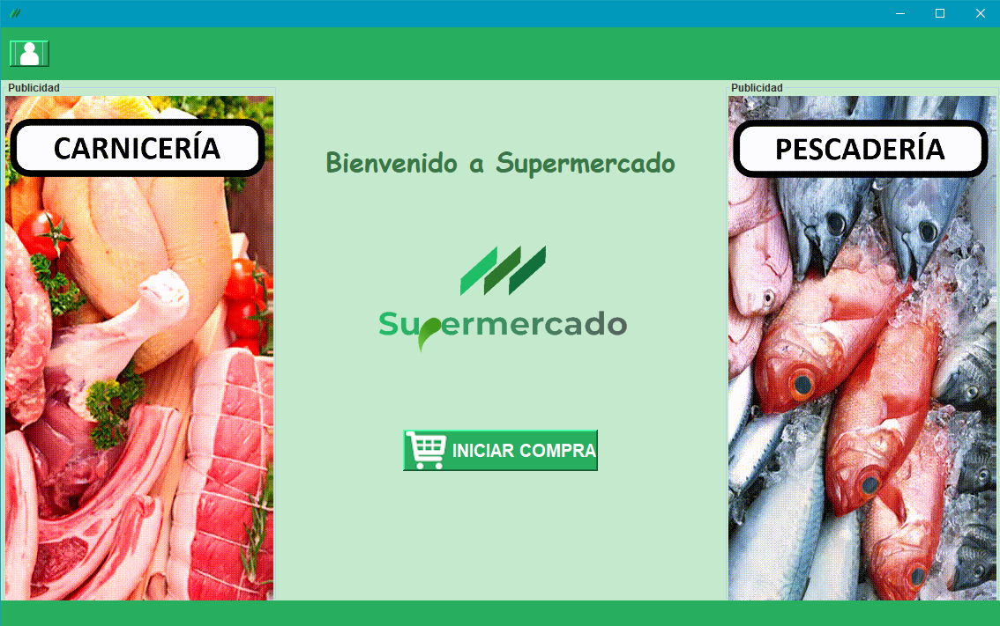
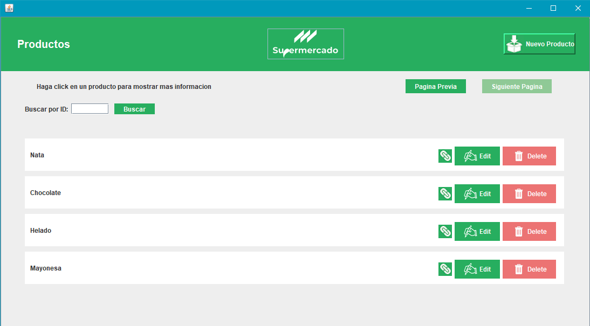
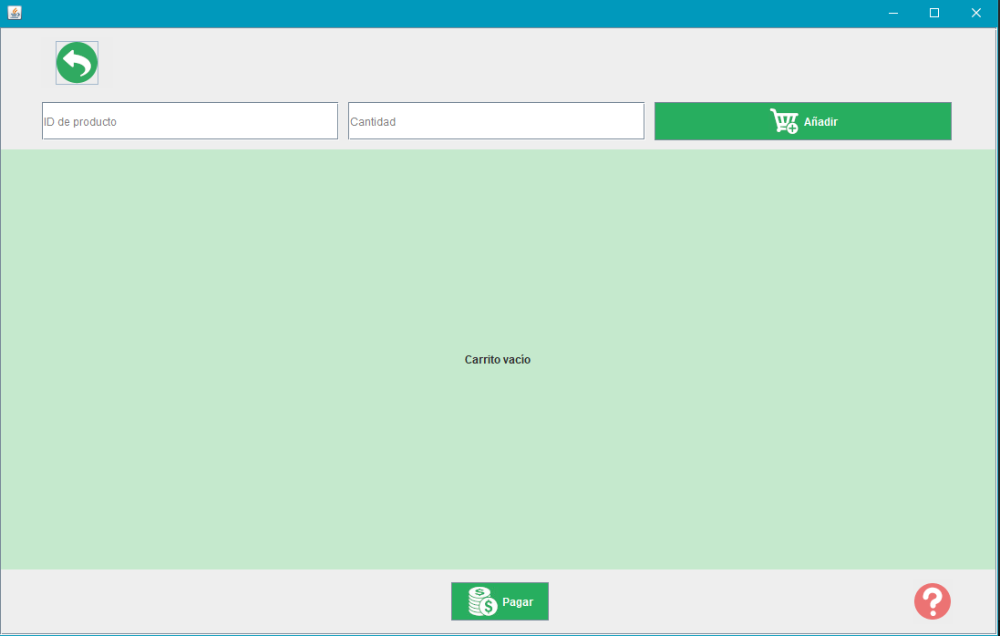

<h1 align="center">
   
  
</h1>

# Supermercado

Supermercado es una aplicación de escritorio para controlar las compras que se realicen, los productos, las marcas de éstos y los proveedores que las distribuyen.

## Información

La aplicación Supermercado es una copia del proyecto realizado en la asignatura **Ingeniería del Software (IS)** en la **Universidad Complutense de Madrid (UCM)**.
El proyecto fue realizado por un equipo de 8 personas, organizadas en grupos de 4 y dentro de cada grupo por parejas.
Para la implementación de la aplicación se empleó IBM RSAD.

El programa desarrollado es un software de gestión de auto compra de supermercados.
A través de este software, el cliente puede hacer su compra en la tienda física sin necesidad de que le atienda un cajero. A la hora de comprar, el cliente debe iniciar sesión introduciendo su DNI para poder acceder a la interfaz de auto compra.
El software proporciona un control sobre todas las compras que se realicen, ya sean efectuadas por los trabajadores o por los clientes mediante auto compra. También controlara los productos, las marcas de estos y los proveedores que las distribuyen.

Donde se almacenaban todos los objetos declarados era en una base de datos MySQL pública la cual por problemas económicos ya no existe.

## Interfaces

Al no tener un vídeo en el que se ve su funcionamiento, solo puedo otorgar capturas de algunas interfaces que conformaban el proyecto

Esta sería la interfaz principal, la cual nada más abrir la aplicación te saldría.
En caso de que seas un cliente darías a iniciar compra y te llevaría a la interfaz de carrito la cuál comento más detalladamente más abajo.
En el caso de que seas un empleado del supermercado, te registrarías con el botón de la esquina superior izquierda. Una vez registrado se desplegará de arriba un navbar con las distintas secciones a las cuales podrás acceder y realizar modificaciones, añadir, y eliminar. Un ejemplo de una de éstas interfaces sería la siguiente:

Como se puede observar en la imagen ésta esta compuesta por una cabecera en la cual está el logo de la aplicación (pulsándolo te lleva a la pestalla de inicio) y a su derecha el botón para añadir un producto. Al pulsar a dicho botón aparecería un modal en el cuál tendrías que especificar toda la información para añadirlo (nombre, marca, proveedor, tipo, etc.).
Debajo de ésta cabecera aparece una lista de los productos de los que se dispone, con un sistema de paginación. Se puede buscar un producto en concreto con el buscador de arriba.
Por cada producto de la lista aparece su nombre, haciendo click sobre él mostrará un modal con su información. También dispone de un botón para vincularlo a un proveedor, modificar el producto o eliminarlo.
En caso de que no seas un empleado esta es la interfaz que te saldría al darle a iniciar compra:

Esta interfaz tiene un botón de vuelta a la pestaña inicial en la esquina superior izquierda. A continuación tiene un buscador del producto con su repectiva cantidad (buscándolos a través de su ID) y el botón para añadirlo a esta lista. Una vez añadido puedes incrementarle o disminuirle la cantidad si lo desea.
Una vez añadida toda la lista se pulsa sobre el botón de pagar, en éste se validará si existe el id del producto o no, y en caso de que exista que haya la cantidad solicitada. En caso de que uno de éstos factores sucedan, no te permitirá realizar el pago indicándote el motivo. En caso de que todo se cumpla, te permitirá elegir el método de pago (tarjeta o efectivo) y proceder a ello para finalizar la compra.

## Propietario
* **Alberto Alejandro** Rivas Fernández
* **Carlos** Gómez López
* **Carlos** Forriol Molina
* **Javier** de Hoyos Pino
* **Luis** Enrique Barrero Peña
* **Mario** González de Santos
* **Miguel** Marcos Asenjo
* **Pablo** Gamo González
